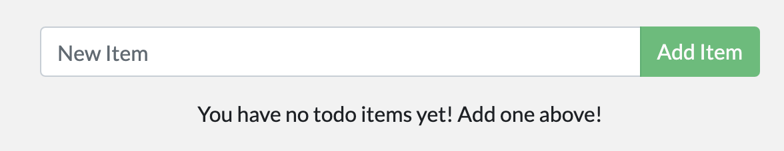

## Docker Desktop Getting Started

运行Docker Desktop。打开Dashboard，没有项目，有引导教程。

### 案例一

在PS执行命令

```
docker run -dp 80:80 docker/getting-started
```

等待下载后。在Docker Desktop显示新建了项目，

打开网页，显示教程的网页。


### 案例二

#### Our Application

继续浏览案例一运行的教程网页。

下载源码

新建 `Dockerfile` ，在 `package.json` 的同级目录下

```
FROM node:12-alpine
WORKDIR /app
COPY . .
RUN yarn install --production
CMD ["node", "/app/src/index.js"]
```

编译容器镜像

```
docker build -t getting-started .
```

启动镜像

```
docker run -dp 3000:3000 getting-started
```

运行


#### 更新App

修改网页源码，重新编译。

提示网络问题

```
info There appears to be trouble with your network connection. Retrying...
```

要等几分钟才build好。

查看容器ID

```
docker ps
```

停止容器

```
# Swap out <the-container-id> with the ID from docker ps
docker stop <the-container-id>
```

删除容器

```
docker rm <the-container-id>
```

查看更新成功。



#### 分享App

到[Docker Hub](https://hub.docker.com/) 新建仓库 `getting-started`。

push报错

```
> docker push docker/getting-started
The push refers to repository [docker.io/docker/getting-started]
06dd99642831: Layer already exists
4540f741dcb5: Layer already exists
debb5485a52f: Preparing
beee9f30bc1f: Layer already exists
denied: requested access to the resource is denied
```

打tag

```
docker tag getting-started obarong/getting-started
```

再次push，成功。

```
> docker push obarong/getting-started
The push refers to repository [docker.io/obarong/getting-started]
a1f66b8b9669: Layer already exists
749245fd8261: Layer already exists
e73a7f1d22db: Layer already exists
501154e4b55f: Layer already exists
54b8a9e61578: Layer already exists
4ece4c4c93ba: Layer already exists
3e207b409db3: Mounted from obarong/docker101tutorial
latest: digest: sha256:aca6409a2fc1e6af08d5f1ce826b6b7201b518136e35e055e50928a70c3a976b size: 1788
```

打开[Play with Docker](http://play-with-docker.com/)，运行新实例

```
docker run -dp 3000:3000 obarong/getting-started
```

成功在远端打开网页。

#### 保留数据库

创建卷

```
docker volume create todo-db
```

运行挂载卷

```
docker run -dp 3000:3000 -v todo-db:/etc/todos getting-started
```

添加TODO事项，删除容器，运行新的容器，数据有保留。成功


查看卷挂载位置

```
> docker volume inspect todo-db
[
    {
        "CreatedAt": "2020-06-28T06:32:29Z",
        "Driver": "local",
        "Labels": {},
        "Mountpoint": "/var/lib/docker/volumes/todo-db/_data",
        "Name": "todo-db",
        "Options": {},
        "Scope": "local"
    }
]
```

#### 使用绑定挂载

略……


## Docker Desktop Learn

右键托盘的图标，选Learn。

这个Learn跟上面的案例一有点区别，这是从下载源码开始的。从GitHub下载太慢，开全局FQ会快一点。

```
git clone https://github.com/docker/getting-started.git
cd getting-started
docker build -t docker101tutorial .
```


Build成功

运行


运行效果跟上面的教程一样。

分享


查看分享


完成。

